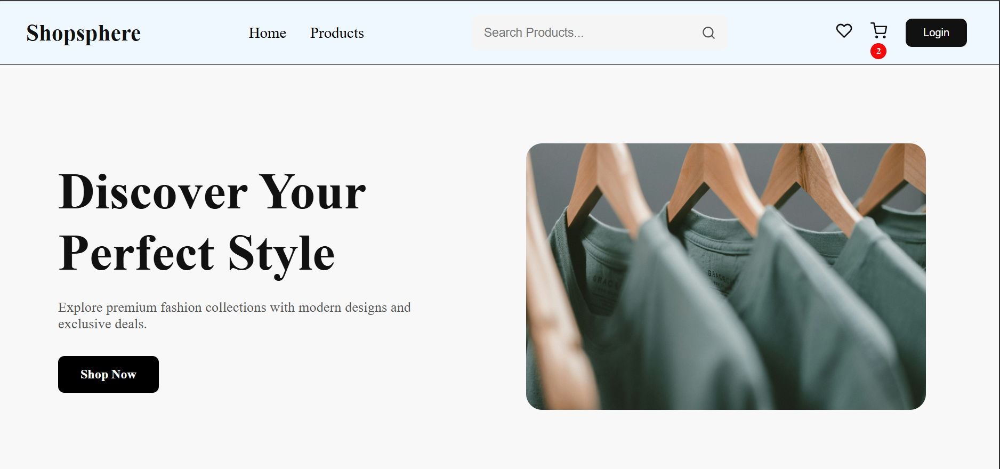
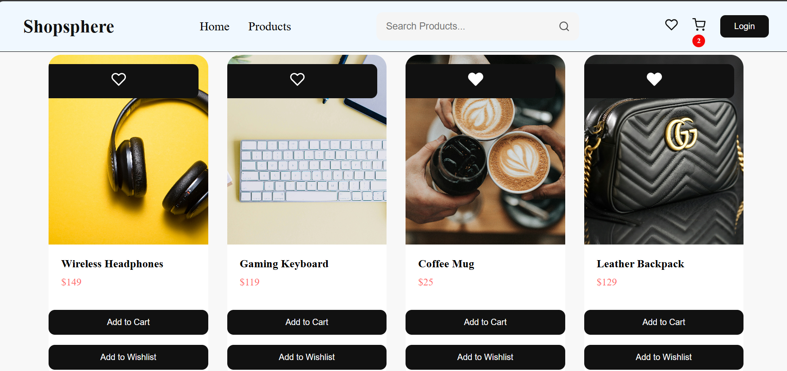
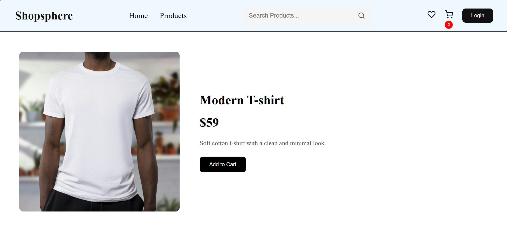
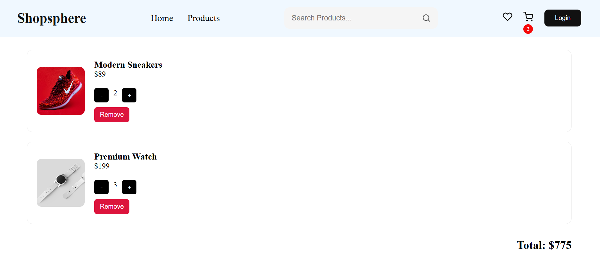
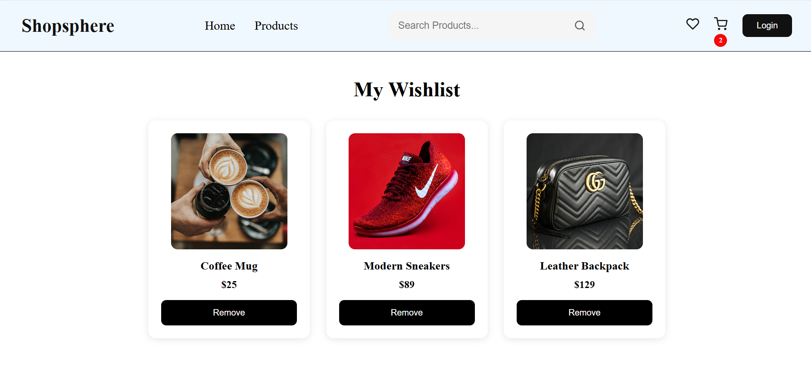

# Shopsphere – E-commerce Web Application

## Overview

Shopsphere is a responsive e-commerce web application built using React.js. The application allows users to browse products, search for items, manage favorites, and update cart quantities through an interactive user interface.

## Features

* Product listing with 8 products
* Search functionality
* Favorites management
* Shopping cart functionality
* Cart quantity increment and decrement controls
* Responsive design for mobile, tablet, and desktop devices
* Reusable React components

## Technologies Used

* React.js
* JavaScript (ES6+)
* HTML5
* CSS3

## Live Demo

https://shopsphere-web.netlify.app/

## Installation

1. Clone the repository
2. Run `npm install`
3. Run `npm run dev`

## Learning Outcomes

* React component architecture
* State management
* Search implementation
* Cart functionality (add, remove, update quantity)
* Responsive web design

## Screenshots

* Home Page

* Featured Products Page

* Product Description Page

* Cart Page

* Wishlist Page

